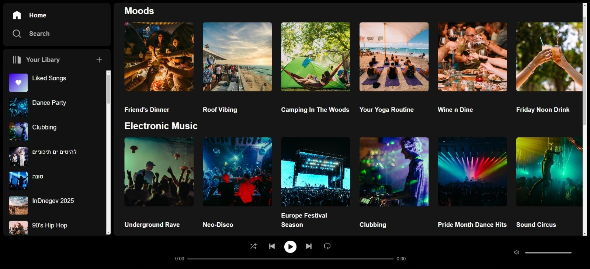
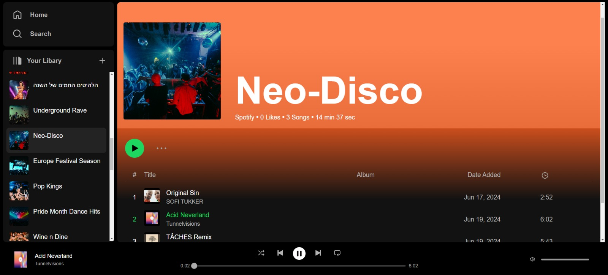

# Rythmix

# Rythmix

## Backend repository for Rythmix

**Frontend repository:**
https://github.com/liron28/Rythmix



Rythmix is a web application inspired by Spotify, enabling users to access music, create and share playlists, and manage their music preferences. The application leverages the YouTube Data API for music content, with a React frontend and a Node.js backend. Data is stored using MongoDB Atlas.



## How to use - Installation

To get started with the Rythmix-backend project, follow these steps:

1. **Clone the repository**:

   ```bash
   git clone https://github.com/liron28/Rythmix.git
   ```

2. **Navigate to the project directory**:

   ```bash
   cd Rythmix-backend
   ```

3. **Install dependencies**:

   Make sure you have [Node.js](https://nodejs.org/) installed. Then run:

   ```bash
   npm install
   ```

## Usage

To start the development server, use the following command:

```bash
npm run dev
```

Server will run on port 3030

Go to "http://localhost:3030" to use app

## Features

- **Music Access**: Search and play music using the YouTube Data API.
- **Playlists**: Create, manage, and share playlists.
- **Database**: Store user data and playlists in MongoDB Atlas.

## Technologies Used

- **Frontend**: React, Redux, Axios, Sass
- **Backend**: Node.js, Express
- **Database**: MongoDB Atlas
- **API**: YouTube Data API v3

## Libaries

- **API**: YouTube Data API v3
- **Player**: react-player

## Prerequisites

- Node.js (v12.x or later)
- MongoDB Atlas account
- YouTube Data API key

## Project Structure

- **client**: Contains the React frontend

  - **src**
    - **components**: React components
    - **redux**: Redux actions and reducers
    - **services**: API services
    - **styles**: CSS files
    - **App.js**: Main App component
    - **index.js**: Entry point

- **server**: Contains the Node.js backend
  - **controllers**: Request handlers
  - **routes**: Express routes
  - **middlewares**: Custom middlewares
  - **app.js**: Express app setup
  - **server.js**: Server entry point
